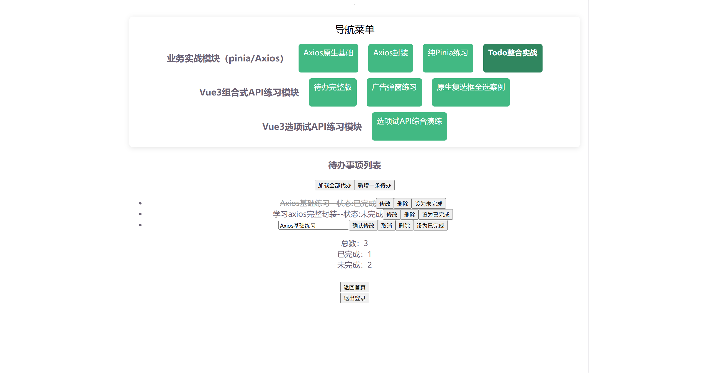

# Vue3 TodoList 待办管理项目
> 基于 Vite + Vue3 开发的待办任务管理单页应用，前端实习作品集项目。
> 实现任务增删改查、状态筛选、本地持久化；封装Axios请求，使用Pinia管理全局状态，熟悉组件拆分与父子通信。




## 🧰 技术栈
- 构建工具：Vite
- 框架：Vue3（Composition API）
- 状态管理：Pinia
- 网络请求：Axios（封装请求拦截器）
- 路由：Vue Router
- UI组件库：Element Plus
- 本地存储：localStorage

## ✨ 项目功能
1. 待办任务：新增、删除、修改、切换完成状态
2. 任务筛选：支持查看全部 / 已完成 / 未完成任务
3. 数据持久化：结合localStorage，页面刷新数据不丢失
4. 组件化开发：拆分页面、公共组件，父子组件通信并做Props类型校验
5. 全局状态：使用Pinia统一管理待办数据，跨组件共享状态
6. 请求封装：Axios拦截器统一处理token、接口异常、错误提示
7. 计算属性&监听：使用computed筛选任务，watch监听数据变化同步本地存储


## 🚀 项目启动
```bash
# 安装依赖
npm install

# 本地开发启动
npm run dev

# 打包构建
npm run build
```


## 📁 项目目录
```

vue3-pinia-axios-practice
├── public          # 静态资源
├── src
│   ├── api         # 请求接口
│   ├── assets      # 图片资源
│   ├── components  # 公共组件
│   ├── router      # 路由配置
│   ├── stores      # Pinia状态仓库
│   ├── views       # 页面组件
│   ├── App.vue
│   └── main.js
├── .gitignore
├── index.html
└── package.json
```

## 📌 项目亮点
1. Axios统一二次封装：配置请求拦截携带token，响应拦截统一捕获接口错误，减少重复代码
2. Pinia全局状态管理：替代Vuex，简化跨组件数据共享，代码结构更清爽
3. 组件合理拆分：页面与公共组件解耦，Props添加类型校验，提升项目可维护性
4. 持久化方案：监听 Pinia 仓库数据变化自动同步到 localStorage，页面刷新数据不丢失
5. 工程化规范：目录分层清晰（api、stores、router、components），符合前端项目规范
6. 引入 Element Plus 组件库快速搭建页面 UI，专注业务逻辑开发

## 🔗 仓库地址
- GitHub：https://github.com/wangyixiao2024/vue_todo_demo  
- Gitee:  https://gitee.com/wang-yi-xiao01/vue_todo_demo


